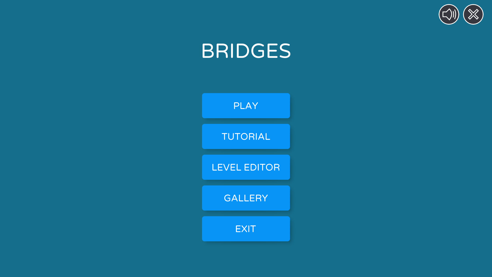
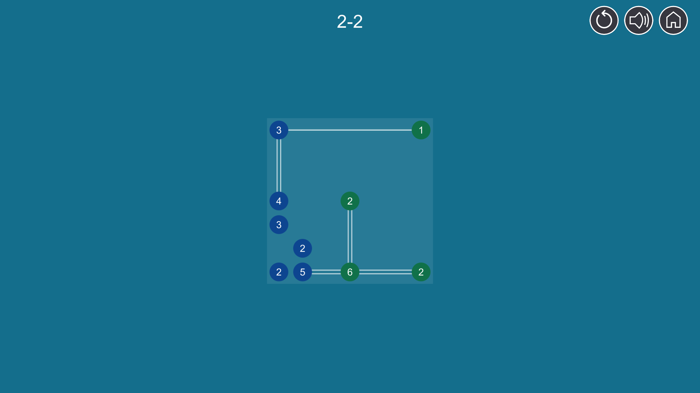
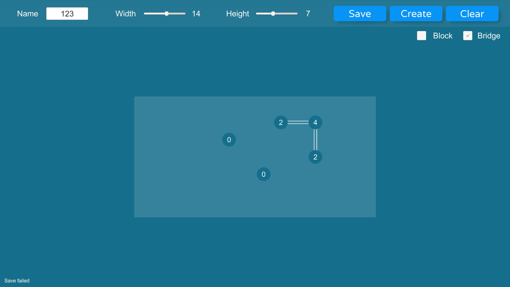
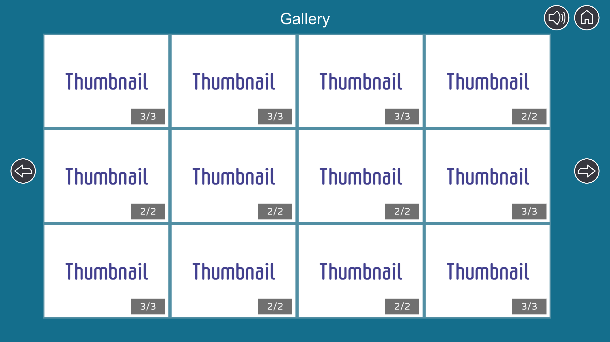

# Hashi Game
* Hashiwokakero (Build bridges) is a logic puzzle game, you can find the explicit rule on [Wikipedia](https://en.wikipedia.org/wiki/Hashiwokakero).  
* Made with Unity.  

## Contents
* Over 30 levels are playable.
  
* An editor is provided for creating and editing levels.
* The level infomation is saved as .json file.
  
* A simple gallery system is given, which could be useful for visual novels.
* A save system based on StreamingAssets is also provided. 
  
